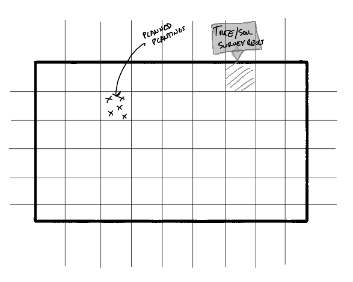

# Land Manager Application  
  
  
## *plot.xml* Object Specifications  
 - `property`  
    - `geo-coord-center`: The geographical center of `property` to be treated as (0,0) when calculating (x,y) coordinates based on geographical coordinates.  
        - `latitude`: as a float.  
        - `longitude`: as a float.  
    - `polygon`: The `property` boundaries.  
        - `vertex`: A property corner. Boundaries are drawn from `vertex`-to-`vertex`, clockwise in order of definition.  
            - `x-coord`: the x-coordinate of this `vertex`.  
            - `y-coord`: the y-coordinate of this `vertex`.  
    - `description`: A description of this `property`.  
 - `polygon`: A polygon to draw on the map.  
    - `vertex`: A vertex of the `polygon`, drawn from `vertex`-to-`vertex`, clockwise in order of definition.  
      - `x-coord`: the x-coordinate of this `vertex`.  
      - `y-coord`: the y-coordinate of this `vertex`.  
    - `description`: A description of this `polygon`.  
 - `point`: A point to draw on the map.   
    - `x-coord`: the x-coordinate of this `point`.  
    - `y-coord`: the y-coordinate of this `point`.  
    - `description`: A description of this `point`.  
  
 ## Notes  
 - updates to plot.xml ignored using: `git update-index --skip-worktree` ([see this StackOverflow post](https://stackoverflow.com/questions/4348590/how-can-i-make-git-ignore-future-revisions-to-a-file))  